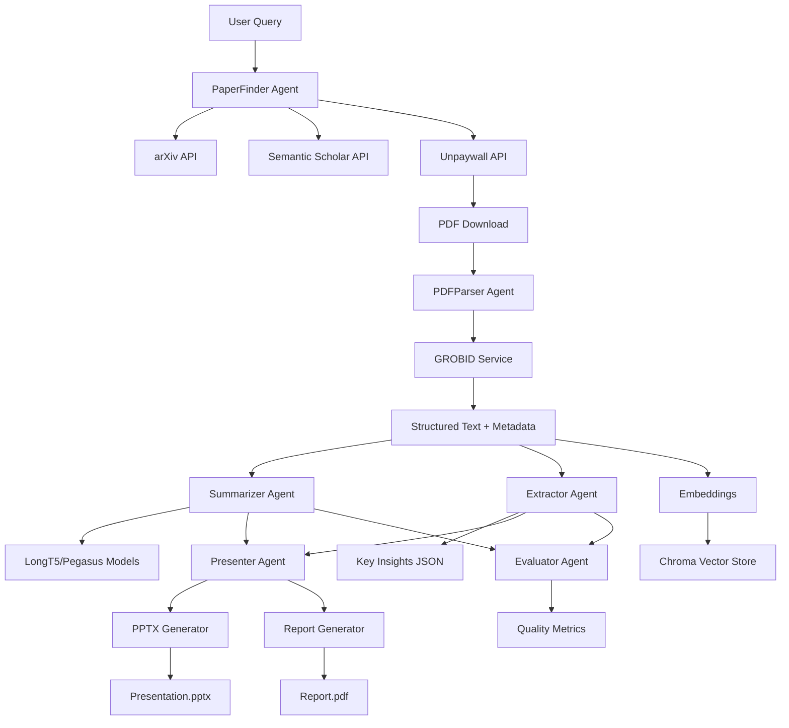

# ScholarGenie

**ScholarGenie** is a multi-agent system that autonomously discovers scientific papers, parses and ingests them, extracts key insights, stores searchable knowledge, and generates presentation-ready slides and reports.

[](https://opensource.org/licenses/MIT)

## Features

- **Automated Paper Discovery**: Search arXiv and Semantic Scholar APIs
- **Open Access PDF Retrieval**: Find free PDFs via Unpaywall
- **Structured PDF Parsing**: Extract metadata, sections, figures using GROBID
- **Multi-Granularity Summarization**: TL;DR, section summaries, full abstracts, key bullets
- **Semantic Search**: Vector store with Chroma/FAISS for retrieval
- **Auto-Generated Presentations**: PowerPoint slides from paper summaries
- **Auto-Generated Reports**: Markdown and PDF reports
- **Interactive Web UI**: Streamlit demo for exploration
- **100% Free & Open Source**: Uses only open models and tools

## Quickstart

### Docker (Recommended)

```bash
# 1. Clone and configure
git clone https://github.com/Aadhityan-Senthil/ScholarGenie.git
cd ScholarGenie
cp .env.example .env
# Edit .env with your API keys (optional for arXiv, recommended for Semantic Scholar)

# 2. Start all services (GROBID, backend, Streamlit)
docker-compose up -d

# 3. Open browser to http://localhost:8501
```

### Local Development

```bash
# Prerequisites: Python 3.9+, Java 11+ (for GROBID)

# 1. Install dependencies
pip install -r requirements.txt

# 2. Start GROBID service (in separate terminal)
docker run -d --rm --init --ulimit core=0 -p 8070:8070 lfoppiano/grobid:0.7.3

# 3. Configure environment
cp .env.example .env
# Edit config.yaml to adjust models and settings

# 4. Start backend API
cd backend
uvicorn app:app --reload --port 8000

# 5. Start Streamlit demo (in separate terminal)
cd demo
streamlit run streamlit_app.py
```

Visit:
- Streamlit UI: http://localhost:8501
- API docs: http://localhost:8000/docs

## Architecture



### Agent Responsibilities

| Agent | Purpose | Key Technologies |
|-------|---------|-----------------|
| **PaperFinder** | Discovers papers via APIs, resolves OA PDFs | arXiv, Semantic Scholar, Unpaywall |
| **PDFParser** | Extracts structured content from PDFs | GROBID, PyMuPDF (fallback) |
| **Summarizer** | Multi-level summarization (TL;DR, sections, full) | LongT5, Pegasus, Longformer |
| **Extractor** | Extracts methods, datasets, metrics, results | NLP + regex patterns |
| **Presenter** | Generates slides and reports | python-pptx, Markdown→PDF |
| **Evaluator** | Quality checks and metrics | ROUGE, BERTScore |

## Usage Examples

### CLI Tool

```bash
# Search and ingest papers
python scripts/scholargenie-cli.py search "transformer language models" --max-results 5

# Generate presentation from DOI
python scripts/scholargenie-cli.py generate-pptx --doi "10.48550/arXiv.1706.03762" --output attention.pptx

# Batch ingest from file
python scripts/scholargenie-cli.py batch-ingest papers.txt
```

### Python API

```python
from backend.agents.paper_finder import PaperFinderAgent
from backend.agents.summarizer import SummarizerAgent
from backend.agents.presenter import PresenterAgent

# Find papers
finder = PaperFinderAgent()
papers = finder.search("quantum computing", max_results=10)

# Summarize a paper
summarizer = SummarizerAgent()
summary = summarizer.summarize_paper(papers[0])

# Generate presentation
presenter = PresenterAgent()
presenter.generate_pptx(summary, output_path="presentation.pptx")
```

### REST API

```bash
# Search papers
curl -X POST "http://localhost:8000/api/search" \
  -H "Content-Type: application/json" \
  -d '{"query": "neural networks", "max_results": 5}'

# Ingest paper by DOI
curl -X POST "http://localhost:8000/api/ingest" \
  -H "Content-Type: application/json" \
  -d '{"doi": "10.48550/arXiv.2103.14030"}'

# Generate presentation
curl -X POST "http://localhost:8000/api/generate-pptx" \
  -H "Content-Type: application/json" \
  -d '{"paper_id": "abc123"}' \
  --output presentation.pptx
```

## Configuration

Edit `config.yaml` to customize:

```yaml
# Model selection
summarization:
  model_name: "google/long-t5-tglobal-base"  # or long-t5-local-base, pegasus-large
  device: "cuda"  # or "cpu"
  max_length: 512
  min_length: 100

embedding:
  model_name: "sentence-transformers/all-MiniLM-L6-v2"

vector_store:
  type: "chroma"  # or "faiss"
  persist_directory: "./data/chroma_db"

# API settings
apis:
  grobid_url: "http://localhost:8070"
  semantic_scholar_api_key: "${SEMANTIC_SCHOLAR_API_KEY}"
  rate_limits:
    arxiv: 3  # requests per second
    semantic_scholar: 10
    unpaywall: 10
```

## Free Resources & Tools Used

All components are 100% free and open source:

- **[GROBID](https://github.com/kermitt2/grobid)**: PDF-to-structured-text extraction (Apache 2.0)
- **[Semantic Scholar API](https://api.semanticscholar.org/)**: Paper discovery and metadata
- **[arXiv API](https://arxiv.org/help/api/)**: Preprint search and access
- **[Unpaywall](https://unpaywall.org/products/api)**: Open Access PDF resolver
- **[LongT5](https://huggingface.co/google/long-t5-tglobal-base)**: Long-document summarization (Apache 2.0)
- **[Pegasus](https://huggingface.co/google/pegasus-large)**: Abstractive summarization (Apache 2.0)
- **[Chroma](https://www.trychroma.com/)**: Vector database (Apache 2.0)
- **[FAISS](https://github.com/facebookresearch/faiss)**: Similarity search (MIT)
- **[LangChain](https://github.com/langchain-ai/langchain)**: Agent orchestration (MIT)
- **[Streamlit](https://streamlit.io/)**: Web UI framework (Apache 2.0)
- **[python-pptx](https://python-pptx.readthedocs.io/)**: PowerPoint generation (MIT)

See [docs/resources.md](docs/resources.md) for setup details and API key instructions.

## API Keys (Optional but Recommended)

Most features work without API keys, but performance improves with:

1. **Semantic Scholar API**: [Request free key](https://www.semanticscholar.org/product/api#api-key-form)
   - Without key: Rate limited to 100 requests/5min
   - With key: 5000 requests/5min

2. **arXiv**: No key needed (respect rate limits: 3 req/sec)

3. **Unpaywall**: Email required in User-Agent (free, no signup)

Add to `.env`:
```bash
SEMANTIC_SCHOLAR_API_KEY=your_key_here
UNPAYWALL_EMAIL=your@email.com
```

## Project Structure

```
ScholarGenie/
├── backend/               # Core application
│   ├── app.py            # FastAPI server
│   ├── agents/           # Multi-agent modules
│   ├── utils/            # Storage, embeddings, models
│   └── tests/            # Unit tests
├── demo/                 # Streamlit web UI
├── docs/                 # Documentation
├── infra/                # Docker configs
├── notebooks/            # Jupyter examples
├── scripts/              # CLI tools
├── config.yaml           # Configuration
└── docker-compose.yml    # Container orchestration
```

## Development

### Running Tests

```bash
# Run all tests
pytest backend/tests/ -v

# Run with coverage
pytest backend/tests/ --cov=backend --cov-report=html

# Quick smoke test
pytest backend/tests/test_pipeline_small.py -v
```

### Linting & Formatting

```bash
# Lint
flake8 backend/ demo/ scripts/

# Format
black backend/ demo/ scripts/
```

### GPU vs CPU

**GPU mode** (faster, recommended):
```yaml
# config.yaml
summarization:
  device: "cuda"
  model_name: "google/long-t5-tglobal-large"
```

**CPU mode** (slower, works everywhere):
```yaml
summarization:
  device: "cpu"
  model_name: "google/long-t5-tglobal-base"  # Use smaller model
```

## Troubleshooting

### GROBID connection failed
```bash
# Ensure GROBID is running
docker ps | grep grobid

# Restart GROBID
docker restart grobid
```

### Out of memory on GPU
```yaml
# Use smaller model in config.yaml
summarization:
  model_name: "google/long-t5-local-base"
  batch_size: 1
```

### PDF parsing fails
System will automatically fall back to PyMuPDF if GROBID is unavailable.

## Ethics & Legal

- **Respect Copyright**: Only use Open Access papers or those you have rights to access
- **API Terms**: Follow rate limits and terms of service for all APIs
- **No Scraping**: Do not circumvent paywalls or violate robots.txt
- **Attribution**: Cite papers and tools appropriately

## Contributing

Contributions welcome! Please:

1. Fork the repository
2. Create a feature branch (`git checkout -b feature/amazing-feature`)
3. Run tests (`pytest backend/tests/`)
4. Commit changes (`git commit -m 'Add amazing feature'`)
5. Push to branch (`git push origin feature/amazing-feature`)
6. Open a Pull Request

See `.github/workflows/ci.yml` for CI requirements.

## License

MIT License - see [LICENSE](LICENSE) for details.

## Citation

```bibtex
@software{scholargenie2025,
  title={ScholarGenie: AI-Powered Research Intelligence Platform},
  author={Aadhityan Senthil and Gnanamoorthi P V and J Gold Beulah Patturose and R Priscilla},
  year={2025},
  url={https://github.com/Aadhityan-Senthil/ScholarGenie},
  institution={St. Joseph's Institute of Technology, Chennai}
}
```

## Acknowledgments

Built with amazing open-source tools from:
- Google Research (LongT5, Pegasus)
- Hugging Face (Transformers, Datasets)
- INRIA (GROBID)
- Meta AI (FAISS)
- Semantic Scholar, arXiv, Unpaywall teams

## Roadmap

- [ ] Support for more paper sources (PubMed, bioRxiv)
- [ ] Multi-language support
- [ ] Custom fine-tuning pipeline for domain-specific summarization
- [ ] Graph-based knowledge extraction
- [ ] Collaborative annotation features
- [ ] Integration with reference managers (Zotero, Mendeley)

---

**Star this repo** if you find it useful! Questions? Open an issue.
